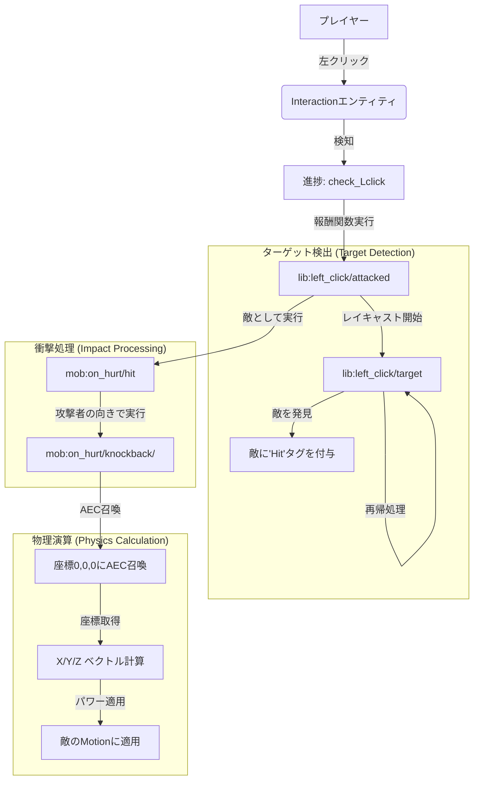
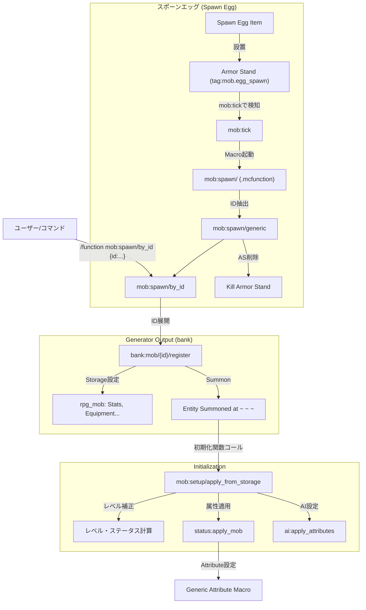

# System Flow Documentation

このドキュメントでは、データパック内の主要なシステムの処理フローをまとめています。

## ⚔️ 戦闘システム (Custom Left-Click & Knockback)

### 概要
InteractionエンティティとAdvancementを組み合わせた「左クリック検知」と、ベクトル演算による「カスタムノックバック」のフローです。

### フロー図

### 主要コンポーネント
1.  **左クリック検知 (`lib:left_click`)**
    *   **Tick処理**: 常に目の前に `interaction` エンティティを維持。
    *   **Trigger**: `advancement/check_Lclick` (player_hurt_entity) で殴った瞬間をフック。
2.  **ターゲット特定 (`lib:left_click/target`)**
    *   視線方向に再帰的なレイキャストを行い、Hitタグを付与。
3.  **ノックバック計算 (`mob:on_hurt/knockback`)**
    *   **ベクトル生成**: `rotated as attacker` 状態で `positioned 0 0 0` にAECを召喚してベクトルを取得。
    *   **倍率適用**: スコアボード (`&XPower`, `&YPower`, `&ZPower`) で強さをXYZ個別に制御。
    *   **適用**: 計算結果を敵の `Motion` タグに書き込む。

---

## 🧟 MOBスポーンシステム

### 概要
Pythonジェネレーターで生成されたデータバンクファイル (`bank:mob/...`) を利用し、ID指定でモブを召喚・初期化するフローです。

### フロー図

### 主要コンポーネント
1.  **呼び出し (`mob:spawn/by_id`)**
    *   Macro引数 `{id:"..."}` を受け取り、対応するBankファイルを呼び出すエントリーポイント。
2.  **スポーンエッグ検知 (`mob:tick`)**
    *   アーマースタンドとして設置されたスポーンエッグ (`mob.egg_spawn`) を毎tick検知。
    *   NBTから `RPGMobId` を読み取り、自動的に `mob:spawn/generic` を経由して `by_id` を呼び出します。
3.  **データ登録 (`bank:mob/.../register`)**
    *   **生成元**: `generate_mobs.py`

    *   モブ固有のデータ（名前、装備、基礎ステータス）をStorageに保存し、エンティティを召喚します。
3.  **初期化 (`mob:setup/apply_from_storage`)**
    *   全モブ共通の初期化ロジック。
    *   Storageからデータを読み出し、レベル補正などを掛けてスコアボードに展開します。
4.  **ステータス適用 (`status:apply_mob`)**
    *   計算されたスコア（STR, DEFなど）を実際のマイクラのAttribute（攻撃力、防具値など）に変換・適用します。
    *   注: Damage計算をカスタムする場合はここでAttribute設定を行わない場合もあります。
