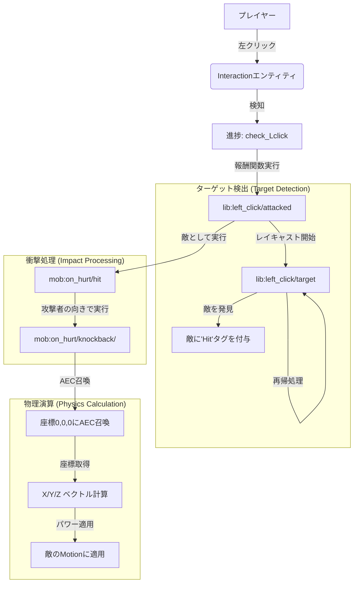
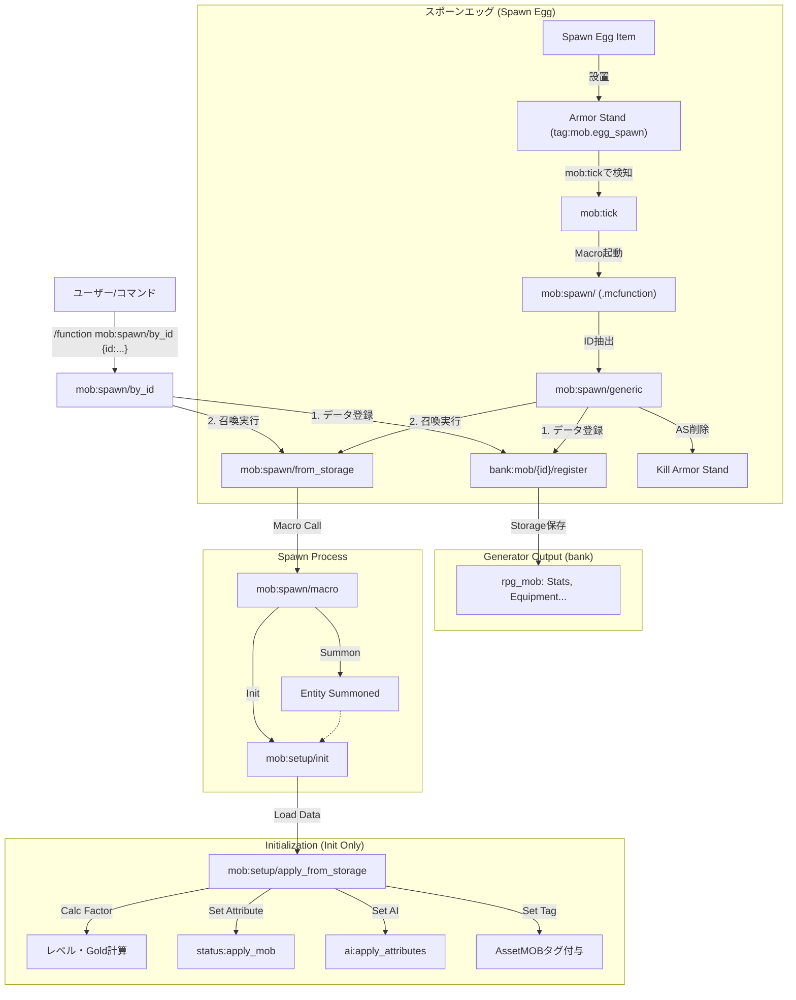

# System Flow Documentation

このドキュメントでは、データパック内の主要なシステムの処理フローをまとめています。

## ⚔️ 戦闘システム (Custom Left-Click & Knockback)

### 概要
InteractionエンティティとAdvancementを組み合わせた「左クリック検知」と、ベクトル演算による「カスタムノックバック」のフローです。

### フロー図

---

## 🧟 MOBスポーンシステム

### 概要
Pythonジェネレーターで生成されたデータバンクファイル (`bank:mob/...`) を利用し、ID指定でモブを召喚・初期化するフローです。
データの**定義**と**召喚**が分離されているのが特徴です。

### フロー図

### 主要コンポーネントとロジック

#### 1. データ登録 (`bank:mob/.../register`)
*   Storage (`rpg_mob:`) にモブの定義情報を書き込みます。
*   **注**: ここでは召喚を行いません。あくまでデータの定義のみです。

#### 2. 召喚と初期化 (`mob:spawn/from_storage` -> `macro` -> `init`)
*   Storageの情報を使って `summon` を行い、直後に `mob:setup/init` を実行します。
*   `init` は `tag=Init` を持つ新規モブに対して**1回のみ**実行されます（ループ監視は行いません）。

#### 3. ステータス計算式 (apply_from_storage / apply_mob)

| ステータス | 計算処理 | 最終適用先 |
| :--- | :--- | :--- |
| **STR** (攻撃力) | **STR =csv値** (直値) | `attribute atomic:attack_damage` |
| **AGI** (速度) | **AGI / 100** | `attribute generic.movement_speed` |
| **DEF** (防御) | **DEF - 5** | `attribute generic.armor` (負なら0) |
| **Gold** | **csv値 * LevelFactor** | `score @s DroppedGold` |
| **レベル補正** | **(Lv - BaseLv) * 5%** | 全ステータスに乗算 |

*   **STR/AGI**: 管理しやすいよう、倍率計算などを廃止し、CSVの数値がそのまま反映される直感的な方式を採用しています。
*   **Gold**: `Luck` ステータスを廃止し、ドロップゴールド (`DroppedGold`) として再実装しました。
