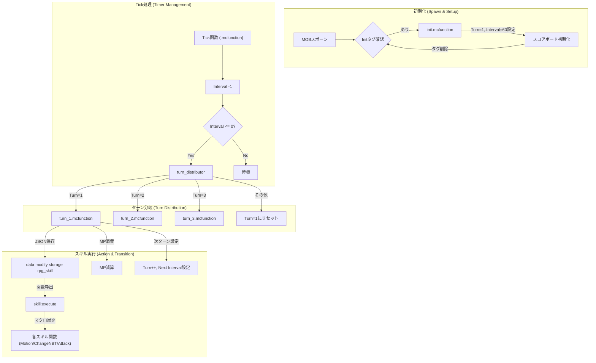

# System Flow Documentation

このドキュメントでは、データパック内の主要なシステムの処理フローをまとめています。

## ⚔️ 戦闘システム (Custom Left-Click & Knockback)

### 概要
InteractionエンティティとAdvancementを組み合わせた「左クリック検知」と、ベクトル演算による「カスタムノックバック」のフローです。

### フロー図

---

## 💎 アイテムステータス適用システム

### 概要
カスタムアイテムのステータス（ATK, STR, DEF等）をメインハンド保持時に動的に適用するシステムです。

### フロー図

---

## 💙 MPバー表示システム (Vanilla XP Bar)

### 概要
VanillaのExperience Barを活用し、MPの現在値と割合を視覚的に表示するシステムです。

### フロー図

### 主要コンポーネント

#### 1. MP自然回復 (`mp/regen/tick`, `mp/regen/`)
- `MPRegenTimer` にタイマー値を加算
- 2000以上で MP+1、タイマーから2000減算
- 超高速回復にも対応（再帰処理）

#### 2. バー更新判定
- `MPRatio` を計算（`MP × 1002 / MaxMP`）
- 前回の `PreviousMPRatio` と比較
- 変化がある場合のみ `bar/set` を実行（効率化）

#### 3. XP容量の動的計算 (`calc_xp.mcfunction`)
Vanillaの経験値公式を使用して、現在のレベル（MP値）における必要経験値を計算：
- Lv 0-15: `2 × Lv + 7`
- Lv 16-30: `5 × Lv - 38`
- Lv 31+: `9 × Lv - 158`

---

## 🧟 MOBスポーンシステム

### 概要
Pythonジェネレーターで生成されたデータバンクファイル (`bank:mob/...`) を利用し、ID指定でモブを召喚・初期化するフローです。
データの**定義**と**召喚**が分離されているのが特徴です。

### フロー図

### 主要コンポーネントとロジック

#### 1. データ登録 (`bank:mob/.../register`)
*   Storage (`rpg_mob:`) にモブの定義情報を書き込みます。
*   **注**: ここでは召喚を行いません。あくまでデータの定義のみです。

#### 2. 召喚と初期化 (`mob:spawn/from_storage` -> `macro` -> `init`)
*   Storageの情報を使って `summon` を行い、直後に `mob:setup/init` を実行します。
*   `init` は `tag=Init` を持つ新規モブに対して**1回のみ**実行されます（ループ監視は行いません）。

#### 3. ステータス計算式 (apply_from_storage / apply_mob)

| ステータス | 計算処理 | 最終適用先 |
| :--- | :--- | :--- |
| **STR** (攻撃力) | **STR =csv値** (直値) | `attribute atomic:attack_damage` |
| **AGI** (速度) | **AGI / 100** | `attribute generic.movement_speed` |
| **DEF** (防御) | **DEF - 5** | `attribute generic.armor` (負なら0) |
| **Gold** | **csv値 * LevelFactor** | `score @s DroppedGold` |
| **レベル補正** | **(Lv - BaseLv) * 5%** | 全ステータスに乗算 |

*   **STR/AGI**: 管理しやすいよう、倍率計算などを廃止し、CSVの数値がそのまま反映される直感的な方式を採用しています。
*   **Gold**: `Luck` ステータスを廃止し、ドロップゴールド (`DroppedGold`) として再実装しました。

---

## 🧙‍♂️ スキルシステム (Skill execution & Turn management)

### 概要
Google Spreadsheetで定義されたデータに基づき、MOBが定期的にスキルを発動するシステムです。「ターン制」と「インターバル制」を組み合わせ、複雑な行動パターンを実現します。

### フロー図

### 主要コンポーネント
1.  **Tickルート (`.mcfunction`)**
    *   **役割**: 毎Tick実行されるメインループ。
    *   **処理**: `Interval` スコアを減算し、0になったら `turn_distributor` を呼び出します。
2.  **ターン振り分け (`turn_distributor.mcfunction`)**
    *   **役割**: 現在の `Turn` スコアを見て、実行すべきターンファイル (`turn/turn_X.mcfunction`) に分岐させます。
3.  **ターンアクション (`turn/turn_X.mcfunction`)**
    *   **スキル準備**: 発動するスキルのJSONデータを `rpg_skill` ストレージに格納します。
    *   **スキル実行**: `function skill:execute` を呼び出し、ストレージ内のデータに基づいて実際のスキル（移動、NBT変更、攻撃など）を発動させます。
    *   **次ターン移行**: 次のターンの番号 (`Turn`) と待機時間 (`Interval`) をセットします。
4.  **スキル実行 (`skill:execute`)**
    *   **役割**: 汎用的なスキル実行関数。
    *   **仕組み**: ストレージ内の `Skill` フィールド（例: "Motion"）を読み取り、対応するスキル関数群 (`skill/motion/declare`, `check`, `run`) へとマクロを使って動的にディスパッチします。
