# System Flow Documentation

このドキュメントでは、データパック内の主要なシステムの処理フローをまとめています。

---

## 🧟 MOB召喚システム

### 概要
ID指定でMOBを召喚・初期化するシステムです。データの**定義**（register）と**召喚**（summon）が分離され、マクロを活用した動的ファイル呼び出しを実現しています。

### フロー図
```mermaid
graph TD
    A["/function debug:summon/001.goblin"] --> B["Storage api: Argument.ID = '001'"]
    B --> C["api:mob/summon"]
    C --> D{ID存在チェック}
    D -->|なし| E[エラーメッセージ]
    D -->|あり| F["api:mob/core/summon"]
    F --> G["bank:mob ID設定"]
    G --> H["bank_manager:mob/summon/register"]
    H --> I["$function bank:mob/alias/001/register"]
    I --> J["bank:mob/001.goblin/register"]
    J --> K["Storage bank:mob データ登録"]
    K --> L["bank_manager:mob/trigger/summon/"]
    L --> M["bank_manager:mob/trigger/summon/macro"]
    M --> N["$function bank:mob/alias/001/summon"]
    N --> O["bank:mob/001.goblin/summon/"]
    O --> P["summon zombie ~ ~ ~ {Tags:[Init]}"]
    P --> Q["bank_manager:mob/summon/init"]
    Q --> R[ステータス適用/CustomName設定]
    R --> S[✅ 召喚完了]
```

### 主要コンポーネント

#### 1. API エントリーポイント (`api:mob/summon`)
- `storage api: Argument.ID` の存在チェック
- IDが存在しない場合はエラーメッセージを表示して終了
- IDが存在する場合は `api:mob/core/summon` を呼び出し

#### 2. コア処理 (`api:mob/core/summon`)
```mcfunction
## ID登録
data modify storage bank:mob ID set from storage api: Argument.ID

## データ呼び出し (マクロ)
function bank_manager:mob/summon/register with storage bank:mob

## 召喚実行
function bank_manager:mob/trigger/summon/

## 初期化
execute as @e[tag=Init,distance=..0.01] run function bank_manager:mob/summon/init
```

#### 3. Alias構造
- `bank:mob/alias/001/register` → `bank:mob/001.goblin/register`
- `bank:mob/alias/001/summon` → `bank:mob/001.goblin/summon/`
- 数字IDから実際のMOBファイルへの橋渡し

#### 4. データ登録 (`bank:mob/001.goblin/register`)
`storage bank:mob` に以下を登録:
- **Base**: Entity, Tags, CustomName
- **Costume**: Mainhand, Offhand, Head, Chest, Legs, Feet
- **Status**: Level, HPMax, ATK, DEF, SPD, GOLD
- **Type**: ENEMY
- **AI**: MovementSpeed, FollowRange, KBResistance

#### 5. 召喚実行 (`bank:mob/001.goblin/summon/`)
```mcfunction
summon zombie ~ ~ ~ {Tags:[Init]}
```

#### 6. 初期化処理 (`bank_manager:mob/summon/init`)
- `tag=Init` 削除
- ID付与（`MobID` スコアボード）
- `tag=BankMob` 付与
- ステータス適用（`bank_manager:mob/summon/apply_status/set`）
- CustomName設定（レベル表示含む）
- チーム割り当て（ENEMY等）

#### 7. ステータス適用 (`apply_status/set`)
- レベル補正計算（基準レベル + 進行度）
- Factor = 100 + (LevelDiff × 5)
- 各ステータスに補正適用:
  - **MaxHP**: `Status.HPMax × Factor / 100`
  - **STR**: `Status.ATK × Factor / 100`
  - **DEF**: `Status.DEF × Factor / 100`
  - **AGI**: `Status.SPD × Factor / 100`
  - **GOLD**: `Status.GOLD × Factor / 100`

---

## ⚔️ プレイヤー攻撃システム

### 概要
InteractionエンティティとAdvancementを組み合わせた二重検知システムです。近距離はInteraction、遠距離はadvancementで効率的にMOBを特定します。

### フロー図
```mermaid
graph TD
    A["advancement lib:player_hurt_entity"] --> B["player:attack/"]
    B --> C[ダメージ計算]
    C --> D["tag=Attacker 付与"]
    D --> E{攻撃方法判定}
    E -->|Interaction検知| F["player:attack/target"]
    E -->|advancement検知| G["filter/8 → filter/0"]
    F --> H["tag=Hit 付与"]
    G --> H
    H --> I["bank_manager:mob/hurt/hit"]
    I --> J[ノックバック]
    J --> K[ダメージ演出]
    K --> L[HP減算]
    L --> M{HP <= 0?}
    M -->|Yes| N["bank_manager:mob/death/"]
    M -->|No| O[ダメージログ表示]
```

### 主要コンポーネント

#### 1. ターゲット検知（Interaction方式）
```mcfunction
# Interactionエンティティ召喚（プレイヤーの視線）
execute anchored eyes positioned ^ ^ ^ run summon interaction ~ ~-0.2 ~ {
    width:2f, height:1f, Tags:["check.Lclick","new","PC"]
}

# リーチ分だけ前進してMOB検知
execute as @s[tag=Attacker] anchored eyes positioned ^ ^ ^ run function player:attack/target
```

**target.mcfunction**:
```mcfunction
# 当たり判定（dx=0テクニック）
execute as @e[tag=Enemy,dx=0] positioned ~-0.75 ~-0.75 ~-0.75 if entity @s[dx=0] run tag @s add Hit

# リーチまで再帰
execute if score @s Reach matches 1.. positioned ^ ^ ^0.25 run function player:attack/target
```

#### 2. フィルター（advancement方式）
階層的フィルター: `filter/8` → `7` → `6` → ... → `0`

**filter/8.mcfunction**:
```mcfunction
execute if entity @a[tag=Attacker,advancements={lib:player_hurt_entity={MobID8.0=true}}] if entity @s[tag=MobID8.0] run function player:attack/filter/7
execute if entity @a[tag=Attacker,advancements={lib:player_hurt_entity={MobID8.1=true}}] if entity @s[tag=MobID8.1] run function player:attack/filter/7
```

最終的に **filter/0.mcfunction**:
```mcfunction
execute if entity @a[tag=Attacker,advancements={lib:player_hurt_entity={MobID0.0=true}}] if entity @s[tag=MobID0.0] run function bank_manager:mob/hurt/hit
```

#### 3. ダメージ計算
```mcfunction
# アイテムの基礎攻撃力を取得
execute store result score &BaseDmg _ run data get entity @s SelectedItem.components."minecraft:custom_data".BankItem[0].ATK

# STR補正を適用
scoreboard players operation &Dmg _ = &BaseDmg _
scoreboard players operation &Dmg _ *= @s STR
scoreboard players operation &Dmg _ /= $100 Const
```

---

## 💥 MOB被ダメージ/死亡システム

### 概要
MOBがダメージを受けた際のノックバック演出、HP管理、死亡時の報酬処理を行います。

### 被ダメージフロー
```mermaid
graph TD
    A["bank_manager:mob/hurt/hit"] --> B[ノックバック計算]
    B --> C["AEC召喚 0,0,0 → ^,^,^0.4"]
    C --> D[Position取得]
    D --> E["Y軸を0.32に固定"]
    E --> F[XZPower倍率適用]
    F --> G[Motionに適用]
    G --> H[ダメージ演出]
    H --> I{MOBタイプ}
    I -->|Undead| J[instant_health]
    I -->|その他| K[instant_damage]
    J --> L[HP減算]
    K --> L
    K --> L[HP減算]
    L --> M[HPバー更新 `mob_manager:hp_bar/update`]
    M --> N{HP <= 0?}
    N -->|Yes| O["death/"]
    N -->|No| P[ダメージログ表示]
```

### ノックバック処理 (`mob/hurt/knockback/`)
```mcfunction
# ふっとばし補正設定
scoreboard players set &XPower _ 100
scoreboard players set &YPower _ 100
scoreboard players set &ZPower _ 100

# AEC召喚（0,0,0 から攻撃者の向き ^,^,^0.4）
execute positioned 0.0 0.0 0.0 run summon area_effect_cloud ^ ^ ^0.4 {Tags:["Knockback"]}

# Position取得
data modify storage bank:mob temp.Pos set from entity @e[type=area_effect_cloud,tag=Knockback,sort=nearest,limit=1] Pos

# Y軸固定（通常のノックバックはY固定なので）
data modify storage bank:mob temp.Pos[1] set value 0.32

# スコアに変換（1000倍）
execute store result score $KnockbackX _ run data get storage bank:mob temp.Pos[0] 1000
execute store result score $KnockbackY _ run data get storage bank:mob temp.Pos[1] 1000
execute store result score $KnockbackZ _ run data get storage bank:mob temp.Pos[2] 1000

# ベクトル補正
scoreboard players operation $KnockbackX _ *= &XPower _
scoreboard players operation $KnockbackY _ *= &YPower _
scoreboard players operation $KnockbackZ _ *= &ZPower _

# Motionに適用
execute store result storage bank:mob temp.Pos[0] double 0.00001 run scoreboard players get $KnockbackX _
execute store result storage bank:mob temp.Pos[1] double 0.00001 run scoreboard players get $KnockbackY _
execute store result storage bank:mob temp.Pos[2] double 0.00001 run scoreboard players get $KnockbackZ _
data modify entity @s Motion set from storage bank:mob temp.Pos
```

### 死亡処理フロー
```mermaid
graph TD
    A["bank_manager:mob/death/"] --> B[EXP計算]
    B --> C{レベル差判定}
    C -->|+5~| D["EXP × 150%"]
    C -->|0~+4| E["EXP × 100%"]
    C -->|-5~-1| F["EXP × 50%"]
    C -->|~-6| G["EXP × 10%"]
    D --> H[プレイヤーにEXP付与]
    E --> H
    F --> H
    G --> H
    H --> I[GOLD計算]
    I --> J["DropGold × 5 × random 80~120%"]
    J --> K[プレイヤーにGOLD付与]
    K --> L[text_display 報酬表示]
    L --> M[MOB削除]
```

### EXP計算 (`death/adj_exp`)
```mcfunction
# 自身のレベルを足す
scoreboard players operation @s EXP += @s LV

# レベル差計算
scoreboard players operation $Diff LV = @s LV
scoreboard players operation $Diff LV -= @p[tag=Attacker] LV

# レベル差による調整
execute if score $Diff LV matches 5.. run scoreboard players operation @s EXP *= $150 Const
execute if score $Diff LV matches 0..4 run scoreboard players operation @s EXP = @s EXP
execute if score $Diff LV matches -5..-1 run scoreboard players operation @s EXP /= $2 Const
execute if score $Diff LV matches ..-6 run scoreboard players operation @s EXP /= $1000 Const
```

### GOLD計算 (`death/adj_gold`)
```mcfunction
scoreboard players operation @s DropGold *= $5 Const
execute store result score $Random _ run random value 8..12  # 80~120%
scoreboard players operation @s DropGold *= $Random _
scoreboard players operation @s DropGold /= $10 Const
```

---

## 💎 アイテムステータス適用システム

### 概要
カスタムアイテムのステータス（ATK, STR, DEF等）をメインハンド保持時に動的に適用するシステムです。

### フロー図
```mermaid
graph TD
    Tick["player:tick"] -->|毎tick実行| StatusApply["player:status/apply_player"]
    StatusApply -->|攻撃力更新| AtkUpdate["player:status/atk/update"]
    
    subgraph "アイテムステータス取得"
        AtkUpdate -->|MainHand確認| Check{SelectedItem存在?}
        Check -->|Yes| ReadNBT["BankItem[0] から読み取り"]
        Check -->|No| Default["デフォルト値"]
        ReadNBT -->|ATK, STR, SPD等| Scores["一時スコアに保存"]
    end
    
    subgraph "攻撃力計算"
        Scores -->|BaseDmg取得| CalcBase["BaseDmg = ATK + STR倍率"]
        CalcBase -->|属性乗算| Attribute["generic.attack_damage 設定"]
    end
    
    subgraph "武器リーチ判定"
        AtkUpdate -->|武器種チェック| ReachUpdate["player:attack/update_reach"]
        ReachUpdate -->|is_spear?| Spear["Reach = 30 (7.5ブロック)"]
        ReachUpdate -->|is_sword?| Sword["Reach = 12 (3.0ブロック)"]
        ReachUpdate -->|is_axe?| Axe["Reach = 10 (2.5ブロック)"]
        ReachUpdate -->|default| DefaultReach["Reach = 8 (2.0ブロック)"]
    end
```

---

## 💙 MPバー表示システム (Vanilla XP Bar)

### 概要
VanillaのExperience Barを活用し、MPの現在値と割合を視覚的に表示するシステムです。

### フロー図
```mermaid
graph TD
    Tick["player:tick"] -->|毎tick実行| RegenTick["player:status/mp/regen/tick"]
    
    subgraph "MP自然回復"
        RegenTick -->|MPRegenTimer加算| Timer["MPRegenTimer += MPRegen"]
        Timer -->|2000以上| Recover["player:status/mp/regen/"]
        Recover -->|MP+1| UpdateMP["MP加算"]
        Recover -->|再帰チェック| Timer
    end
    
    subgraph "MP割合計算"
        RegenTick -->|比率算出| Ratio["MPRatio = MP × 1002 / MaxMP"]
    end
    
    subgraph "バー更新判定"
        Ratio -->|前回と比較| Changed{変化あり?}
        Changed -->|Yes| BarSet["player:status/mp/bar/set"]
        Changed -->|No| Skip["スキップ"]
    end
    
    subgraph "XPバー適用"
        BarSet -->|Level設定| SetLevel["xp set MP levels (macro)"]
        SetLevel -->|容量計算| CalcXP["player:status/mp/calc_xp"]
        CalcXP -->|Vanilla公式| XPReq["XP_Req算出 (Level依存)"]
        XPReq -->|ポイント計算| CalcPoints["Points = XP_Req × MP / MaxMP"]
        CalcPoints -->|Point適用| SetPoints["xp set Points points (macro)"]
    end
```

### 主要コンポーネント

#### 1. MP自然回復 (`mp/regen/tick`, `mp/regen/`)
- `MPRegenTimer` にタイマー値を加算
- 2000以上で MP+1、タイマーから2000減算
- 超高速回復にも対応（再帰処理）

#### 2. バー更新判定
- `MPRatio` を計算（`MP × 1002 / MaxMP`）
- 前回の `PreviousMPRatio` と比較
- 変化がある場合のみ `bar/set` を実行（効率化）

#### 3. XP容量の動的計算 (`calc_xp.mcfunction`)
Vanillaの経験値公式を使用して、現在のレベル（MP値）における必要経験値を計算：
- Lv 0-15: `2 × Lv + 7`
- Lv 16-30: `5 × Lv - 38`
- Lv 31+: `9 × Lv - 158`

---

## ❤️ HPバー表示システム

### 概要
プレイヤーのHPを視覚的にハート表示するシステムです。`HPRatio` 専用スコアを使用して効率化されています。

### フロー図
```mermaid
graph TD
    Update["player:status/hp/update"] --> Calc["HPRatio計算"]
    Calc --> Store["HPRatio = HP × 10000 / MaxHP × 20 / 10000"]
    Store --> Check{"HPRatio = 0 かつ HP > 0?"}
    Check -->|Yes| SetMin["HPRatio = 1"]
    Check -->|No| Continue
    SetMin --> Apply
    Continue --> Apply["storage player: Health = HPRatio"]
    Apply --> Bar["player:status/hp/bar (macro)"]
```

### 主要コンポーネント

#### 1. HP割合計算
```mcfunction
scoreboard players operation @s HPRatio = @s HP
scoreboard players operation @s HPRatio *= $10000 Const
scoreboard players operation @s HPRatio /= @s MaxHP
scoreboard players operation @s HPRatio *= $20 Const
scoreboard players operation @s HPRatio /= $10000 Const

# 最低1ハート表示（0でないのに見えなくなるのを防ぐ）
execute if score @s HP matches 1.. if score @s HPRatio matches ..0 run scoreboard players set @s HPRatio 1
```

#### 2. ハート反映
```mcfunction
# マクロで動的にハート数を設定
$attribute @s generic.max_health base set $(Health)
```

---

## 🎯 システム統合図

```mermaid
graph TB
    subgraph "MOB召喚"
        S1["debug:summon"] --> S2["api:mob/summon"]
        S2 --> S3["register + summon"]
        S3 --> S4[init]
    end
    
    subgraph "プレイヤー攻撃"
        A1[advancement] --> A2["player:attack/"]
        A2 --> A3["target/filter"]
        A3 --> A4["mob/hurt/hit"]
    end
    
    subgraph "MOB処理"
        M1["hurt/hit"] --> M2[knockback]
        M2 --> M3[HP減算]
        M3 --> M4{死亡?}
        M4 -->|Yes| M5["death/"]
        M4 -->|No| M6[ログ表示]
    end
    
    subgraph "MOB攻撃"
        E1[advancement] --> E2["mob/attack/"]
        E2 --> E3[プレイヤーHP減算]
    end
    
    S4 -.-> M1
    A4 --> M1
    M5 --> R[報酬付与]
    E3 --> P["player:status/hp/update"]
```

---

## 📊 重要なScoreboard目標

| Objective | 用途 |
|-----------|------|
| `HP` | エンティティの現在HP |
| `MaxHP` | 最大HP |
| `HPRatio` | HP比率（表示用、専用スコア） |
| `LV` | レベル |
| `STR` | 攻撃力 |
| `DEF` | 防御力 |
| `AGI` | 素早さ |
| `EXP` | 経験値 |
| `GOLD` / `DropGold` | ゴールド |
| `MP` | マジックポイント |
| `MaxMP` | 最大MP |
| `MPRegen` | MP回復量 |
| `MPRegenTimer` | MP回復タイマー |
| `PortalCooldown` | タイマー（PCタグ付きエンティティ用） |
| `Reach` | 武器リーチ |
| `MobID` | MOB識別番号 |

---

## 🏷️ 重要なタグ

| Tag | 用途 |
|-----|------|
| `Init` | 召喚直後のMOB（初期化待ち） |
| `BankMob` | bank:mob由来のMOB |
| `Enemy` | 敵MOB |
| `Attacker` | 攻撃者（プレイヤーまたはMOB） |
| `Victim` | 被害者 |
| `Hit` | 攻撃が当たったMOB |
| `PC` | プレイヤー関連のエンティティ（自動削除対象） |
| `check.Lclick` | 左クリック検知用Interaction |
| `Loot` | 報酬表示のtext_display |
| `ShowDmgLog` | ダメージログ表示フラグ |

---

## 🔧 システムの特徴

### マクロ活用
- ID指定で動的ファイル呼び出し
- `$(ID)` を使った柔軟な構造
- Storage (`bank:mob`) を介したデータ受け渡し

### 二重検知システム
- **近距離**: Interactionエンティティによる物理判定
- **遠距離**: advancementによるイベント検知
- 効率的な範囲分け（10ブロック / 100ブロック）

### 階層フィルター
- `filter/8` → `7` → ... → `0` で段階的に絞り込み
- MobIDタグとadvancements条件の組み合わせ
- 大量のMOBでもパフォーマンスを維持

### レベル補正システム
- プレイヤーとMOBのレベル差でEXP調整
- 格上: 150%、同格: 100%、格下: 50%、雑魚: 10%
- 進行度による動的なレベルスケーリング

### 自動削除機構
- `PC`タグで統一管理
- `PortalCooldown` スコアでタイマー
- 自動clean up

---

## 🚀 使用方法

### MOB召喚
```
/function debug:summon/001.goblin
/function debug:summon/002.skeleton_warrior
/function debug:summon/003.dark_knight
```

### デバッグ
```
/scoreboard objectives setdisplay sidebar HP
/tag @s add ShowDmgLog
/data get storage bank:mob
```

### プレイヤー初期化
```
/function player:init
```

---

**最終更新**: 2026-02-19  
**システムバージョン**: v2.1 (mob_manager/HPバー実装)

---

## 💚 MOB HPバー表示システム (text_display)

### 概要
MOBの頭上にHPバーと現在値/最大値を表示します。`mob_manager` ネームスペースで管理されています。

### フロー図
```mermaid
graph TD
    Hit["bank_manager:mob/hurt/hit"] --> Update["mob_manager:hp_bar/update"]
    
    subgraph "HPバー更新"
        Update --> Calc["HPRatio計算 (0-10000)"]
        Calc --> Init{HPバー存在?}
        Init -->|No| Summon["text_display召喚 (tag=HPBar)"]
        Init -->|Yes| Next
        Summon --> Next
        Next --> Dispatch["hp_bar/apply_text_dispatcher"]
        Dispatch -->|HPRatioに応じた分岐| Color["緑/黄/赤 の文字適用"]
        Color --> Name["CustomName (Level/Name) も同期"]
    end
```

### 構成要素
- **text_display**: `tag=HPBar`。MOBに乗っている(Passenger)。
- **Dispatcher**: HP割合に応じて、使用するファイル（文字色や目盛りの量）を切り替える。
- **フォルダ構造**: `green`, `yellow`, `red` フォルダに各段階の表示ファイルが格納されている。

---

## 🆙 レベルアップ & ステータスシステム

### 概要
EXP蓄積による自動レベルアップと、ポイント消費によるステータス割り振りが実装されています。

### レベルアップフロー
```mermaid
graph TD
    Tick["player:tick"] --> Check{EXP >= nextEXP?}
    Check -->|Yes| LevelUp["player:level/up/"]
    
    subgraph "レベルアップ処理"
        LevelUp --> IncLv["LV + 1"]
        IncLv --> ConsExp["EXP消費"]
        ConsExp --> CalcNext["nextEXP再計算 (Vanilla曲線を模倣)"]
        CalcNext --> Point["StatusPoint + 3"]
        Point --> Heal["HP/MP全回復"]
        Heal --> Effect["エフェクト＆通知"]
        Effect --> Recurse{まだEXP余ってる?}
        Recurse -->|Yes| LevelUp
    end
```

### ステータス割り振りフロー
```mermaid
graph TD
    Trigger["/trigger Menu set 1"] --> Screen["player:status/allocation_screen"]
    Screen --> Display["Tellraw UI表示"]
    Display --> Click["クリック (trigger set 101など)"]
    Click --> Run["trigger/sneak/menu/run/status"]
    
    subgraph "割り振り処理"
        Run --> CheckPt{Point >= 1?}
        CheckPt -->|Yes| AddStat["対象ステータス + 1"]
        AddStat --> ConsPt["StatusPoint - 1"]
        ConsPt --> Sound["LevelUp音"]
        Sound --> ReOpen["UI再表示"]
        
        CheckPt -->|No| Error["エラー音＆メッセージ"]
    end
```
